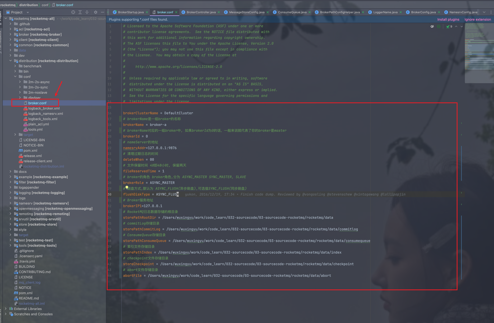
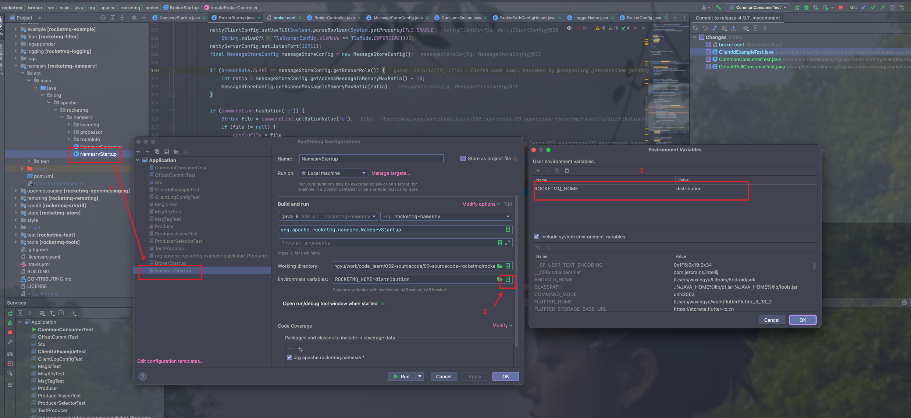
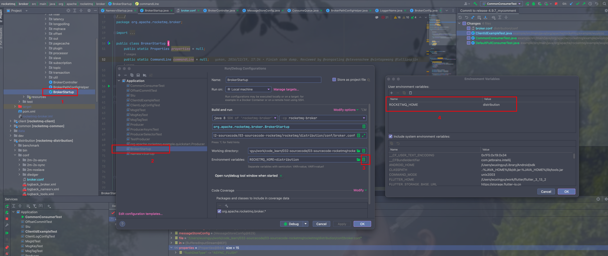
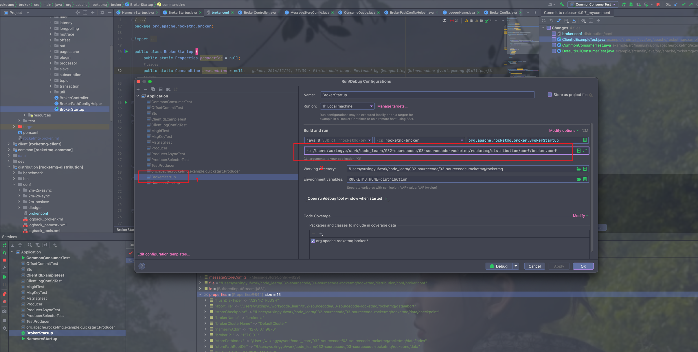
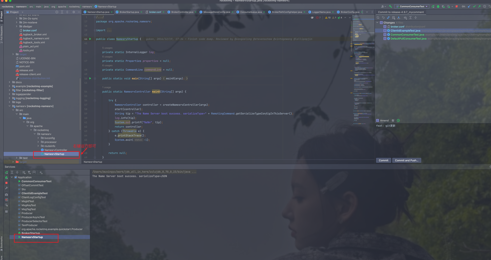
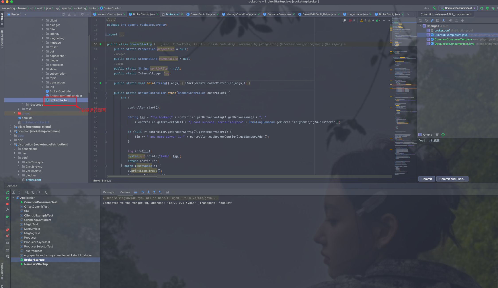

# 1. 前言
```markdown
本篇笔记主要记录如何通过IDEA在本地运行RocketMQ服务, 笔记内容涵盖两部分，第一部分介绍
如何运行RocketMQ，第二部分介绍为什么要配置这些参数
1. RocketMQ版本: v4.9.7
2. 操作系统 macos 14.2
3. IDEA 2023.3.5
```

# 2.1 配置broker.conf文件
> 文件内容如下
```
brokerClusterName = DefaultCluster
# brokerName是一组broker的名称
brokerName = broker-a
# brokerName对应的一组broker中, 如果brokerId为0的话，一般来说就代表了你的broker是master
brokerId = 0
# nameServer的地址
namesrvAddr=127.0.0.1:9876
# 清理过期日志的时间
deleteWhen = 00
# 文件保留时间 48即48小时, 保留两天
fileReservedTime = 1
# broker的角色 broker角色,分为 ASYNC_MASTER SYNC_MASTER, SLAVE
brokerRole = ASYNC_MASTER
# 刷盘方式,默认为 ASYNC_FLUSH(异步刷盘),可选值SYNC_FLUSH(同步刷盘)
flushDiskType = ASYNC_FLUSH
# Broker服务地址
brokerIP1=127.0.0.1
# RocketMQ日志数据存储的根目录
storePathRootDir = /Users/wuxingyu/work/code_learn/032-sourcecode/03-sourcecode-rocketmq/rocketmq/data
# commitLog存储目录
storePathCommitLog = /Users/wuxingyu/work/code_learn/032-sourcecode/03-sourcecode-rocketmq/rocketmq/data/commitlog
# ConsumeQueue存储目录
storePathConsumeQueue = /Users/wuxingyu/work/code_learn/032-sourcecode/03-sourcecode-rocketmq/rocketmq/data/consumequeue
# 索引文件存储目录
storePathIndex = /Users/wuxingyu/work/code_learn/032-sourcecode/03-sourcecode-rocketmq/rocketmq/data/index
# checkpoint文件存储目录
storeCheckpoint = /Users/wuxingyu/work/code_learn/032-sourcecode/03-sourcecode-rocketmq/rocketmq/data/checkpoint
# abort文件存储目录
abortFile = /Users/wuxingyu/work/code_learn/032-sourcecode/03-sourcecode-rocketmq/rocketmq/data/abort
```


# 2. 为NamesrvStartup配置ROCKETMQ_HOME



# 3. 配置BrokerStartUp

## 3.1 配置ROCKETMQ_HOME



## 3.2 指定broker.conf配置文件路径

```markdown
-c /Users/wuxingyu/work/code_learn/032-sourcecode/03-sourcecode-rocketmq/rocketmq/distribution/conf/broker.conf
```



# 4. 启动nameserver与broker

> 启动nameserver



> 启动broker

