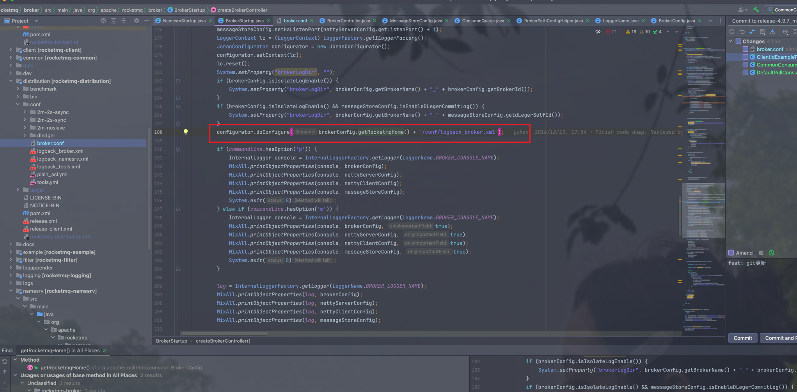
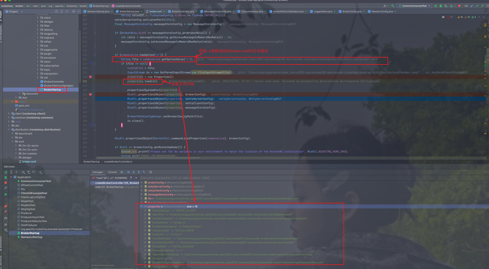

# 1. 为什么要配置ROCKETMQ_HOME?

> 原因: 方便读取distribution下的部分文件

> 以broker服务为例 读取ROCKETMQ_HOME的代码位置为 org.apache.rocketmq.broker.BrokerStartup#createBrokerController，在这里
> broker服务读取了ROCKETMQ_HOME配置的目录下的logback_broker.xml日志配置文件

# 2. broker是如何读取-c参数指定的broker.conf的配置的

> debug源码发现在org.apache.rocketmq.broker.BrokerStartup#createBrokerController
> 方法中通过InputStream将指定文件内容写入到Properties对象中

